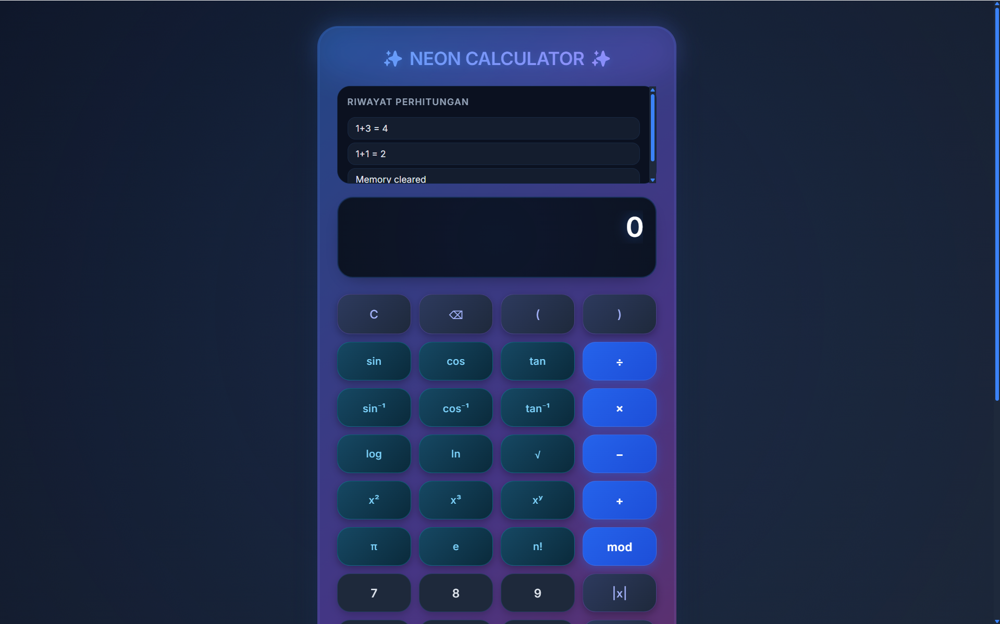

# 🧮 NEON CALCULATOR MODERN


<div align="center">
  
  
  
  
</div>

<br>

<p align="center">
  
</p>

## 👨‍💻 Tentang Creator

<div align="center">
  
| **Informasi** | **Detail** |
|---------------|------------|
| **Nama** | Ilham Xkyo |
| **GitHub** | [@IlhamXkyo](https://github.com/IlhamXkyo) |
| **Email** | [xanderilham4@gmail.com](mailto:xanderilham4@gmail.com) |
| **Project** | Neon Calculator Modern |

</div>

## ✨ Fitur Utama

### 🎨 **Desain Modern**
- Tema gelap dengan aksen neon biru dan ungu
- Efek glassmorphism dan blur
- Animasi background yang dinamis
- Gradient borders yang hidup
- Responsif untuk semua ukuran layar

### 🧮 **Fungsi Kalkulator Lengkap**

#### **Operasi Dasar**
| Simbol | Fungsi |
|--------|--------|
| ➕ | Penjumlahan |
| ➖ | Pengurangan |
| ✖️ | Perkalian |
| ➗ | Pembagian |
| ± | Tanda positif/negatif |
| . | Desimal |
| ( ) | Tanda kurung |

#### **Fungsi Ilmiah**
| Tombol | Fungsi | Contoh |
|--------|--------|--------|
| **sin, cos, tan** | Trigonometri | sin(30°) = 0.5 |
| **sin⁻¹, cos⁻¹, tan⁻¹** | Invers trigonometri | sin⁻¹(0.5) = 30° |
| **log** | Logaritma basis 10 | log(100) = 2 |
| **ln** | Logaritma natural | ln(e) = 1 |
| **√** | Akar kuadrat | √16 = 4 |
| **x²** | Pangkat 2 | 5² = 25 |
| **x³** | Pangkat 3 | 2³ = 8 |
| **xʸ** | Pangkat y | 2⁴ = 16 |
| **n!** | Faktorial | 5! = 120 |
| **π** | Pi (3.14159...) | - |
| **e** | Bilangan Euler (2.71828...) | - |
| **\|x\|** | Nilai absolut | \|-5\| = 5 |
| **1/x** | Resiprokal | 1/4 = 0.25 |
| **mod** | Modulus (sisa bagi) | 7 mod 3 = 1 |

#### **Fitur Lanjutan**
| Fitur | Deskripsi |
|-------|-----------|
| **MS** | Memory Store - Menyimpan angka ke memori |
| **MR** | Memory Recall - Memanggil angka dari memori |
| **MC** | Memory Clear - Menghapus memori |
| **M+** | Memory Add - Menambahkan angka ke memori |
| **History** | Menyimpan 10 perhitungan terakhir |
| **Clickable History** | Klik history untuk menggunakan kembali |

### ⌨️ **Keyboard Support**

| Tombol | Fungsi |
|--------|--------|
| **0-9** | Memasukkan angka |
| **+ - * /** | Operator matematika |
| **Enter / =** | Menghitung hasil |
| **Escape** | Clear semua (C) |
| **Backspace** | Hapus 1 karakter (⌫) |
| **( )** | Tanda kurung |

## 🚀 Cara Menggunakan

### 1. **Clone Repository**
```bash
git clone https://github.com/IlhamXkyo/neon-calculator.git
```

### 2. **Buka File HTML**
```bash
cd neon-calculator
# Buka file index.html di browser favorit Anda
```

Atau langsung akses demo: **[Live Demo](https://IlhamXkyo.github.io/neon-calculator)**

## 🎯 Cara Penggunaan

### **Contoh Perhitungan:**

#### 1. **Operasi Dasar**
```
25 + 13 = 38
15 × 4 = 60
144 ÷ 12 = 12
```

#### 2. **Trigonometri**
```
sin(30) = 0.5  (mode Deg)
cos(60) = 0.5  (mode Deg)
tan(45) = 1    (mode Deg)
```

#### 3. **Fungsi Ilmiah**
```
√144 = 12
5! = 120
log(1000) = 3
ln(e²) = 2
```

#### 4. **Pangkat**
```
5² = 25
2³ = 8
2⁴ = 16  (gunakan 2 xʸ 4)
```

#### 5. **Memory Functions**
```
MS  → Menyimpan angka ke memori
MR  → Memanggil angka dari memori
M+  → Menambah angka ke memori
MC  → Menghapus memori
```

## 🎨 Preview Tampilan

### **Mode Desktop**
```
┌─────────────────────────────────────┐
│        NEON CALCULATOR              │
│         by IlhamXkyo                 │
├─────────────────────────────────────┤
│ ┌─────────────────────────────────┐ │
│ │                     123.456     │ │
│ │                sin(30) = 0.5    │ │
│ └─────────────────────────────────┘ │
│ ┌─────────────────────────────────┐ │
│ │ • sin(30) = 0.5                 │ │
│ │ • 2^3 = 8                       │ │
│ │ • √16 = 4                       │ │
│ └─────────────────────────────────┘ │
│ ┌─────────────────────────────────┐ │
│ │ [C] [⌫] [(] [)] [sin] [cos]    │ │
│ │ [7] [8] [9] [×] [log] [ln]     │ │
│ │ [4] [5] [6] [-] [√]  [x²]      │ │
│ │ [1] [2] [3] [+] [n!] [|x|]     │ │
│ │ [0] [.] [±] [=]                 │ │
│ └─────────────────────────────────┘ │
│ ○ Deg  ○ Rad  ○ Grad                 │
│ [MS] [MR] [MC] [M+]                  │
└─────────────────────────────────────┘
```

### **Mode Mobile**
```
┌─────────────────────┐
│  NEON CALCULATOR    │
│   by IlhamXkyo      │
├─────────────────────┤
│           123.456   │
│      sin(30)=0.5    │
├─────────────────────┤
│ • sin(30)=0.5       │
│ • 2^3=8             │
│ • √16=4             │
├─────────────────────┤
│ C ⌫ ( ) sin cos     │
│ 7 8 9 × log ln      │
│ 4 5 6 - √  x²       │
│ 1 2 3 + n! |x|      │
│ 0 . ± =             │
├─────────────────────┤
│  Deg  Rad  Grad     │
│ MS  MR  MC  M+      │
└─────────────────────┘
```

## 📱 Responsivitas

| Perangkat | Ukuran Layar | Tampilan |
|-----------|--------------|----------|
| 💻 Desktop | > 500px | Layout penuh dengan semua fitur |
| 📱 Mobile | < 500px | Layout yang dioptimalkan untuk layar kecil |
| 📟 Tablet | 500px - 768px | Layout menengah |

## 🎨 Kustomisasi Warna

Edit file `style.css` untuk mengubah tema:

```css
/* Warna Utama - Biru Neon */
:root {
    --primary: #3b82f6;      /* Biru utama */
    --primary-dark: #2563eb;  /* Biru gelap */
    --primary-light: #60a5fa; /* Biru terang */
    --accent: #8b5cf6;        /* Ungu aksen */
    --background: #0f172a;    /* Background gelap */
    --surface: #1e293b;       /* Surface color */
    --text: #ffffff;          /* Teks putih */
}
```

## 🤝 Kontribusi

Kontribusi selalu diterima! Berikut cara berkontribusi:

1. **Fork** repository ini
2. Buat branch baru: `git checkout -b fitur-baru`
3. Commit perubahan: `git commit -m 'Menambah fitur X'`
4. Push ke branch: `git push origin fitur-baru`
5. Buat **Pull Request**

### **Area yang Bisa Dikontribusikan:**
- Menambah fungsi matematika baru
- Memperbaiki bug
- Meningkatkan performa
- Menambah animasi baru
- Optimasi untuk mobile

## 📝 Lisensi

Distributed under the MIT License. See `LICENSE` for more information.

## 📧 Kontak

**Ilham Xkyo**
- **GitHub**: [@IlhamXkyo](https://github.com/IlhamXkyo)
- **Email**: [xanderilham4@gmail.com](mailto:xanderilham4@gmail.com)
- **Project Link**: [https://github.com/IlhamXkyo/neon-calculator](https://github.com/IlhamXkyo/neon-calculator)

## 🙏 Credits

- **Font**: [Inter](https://fonts.google.com/specimen/Inter) by Google Fonts
- **Icons**: Unicode emoji dan karakter khusus
- **Developer**: [Ilham Xkyo](https://github.com/IlhamXkyo)

## 🗺️ Roadmap

- [ ] **Dark/Light mode toggle**
- [ ] **Grafik fungsi sederhana**
- [ ] **Unit converter (panjang, berat, suhu)**
- [ ] **Save history ke local storage**
- [ ] **Scientific constants library**
- [ ] **Export hasil ke file teks**
- [ ] **Multiple themes (Dracula, Monokai, dll)**
- [ ] **Sound effects (opsional)**
- [ ] **Kalkulator binary/hex/octal**

## ⚡ Tips & Trik

### **Shortcuts Cepat**
- Gunakan **parentheses** untuk perhitungan kompleks: `(2+3)×4`
- Manfaatkan **memory** untuk menyimpan hasil sementara
- Klik **history** untuk menggunakan perhitungan sebelumnya

### **Mode Trigonometri**
- **Deg**: Untuk derajat (0° - 360°)
- **Rad**: Untuk radian (0 - 2π)
- **Grad**: Untuk gradian (0 - 400)

## 🐛 Troubleshooting

### **Kalkulator tidak merespons?**
1. Refresh halaman (F5)
2. Clear cache browser
3. Pastikan JavaScript aktif

### **Hasil perhitungan error?**
- Periksa format angka (gunakan titik untuk desimal)
- Pastikan tidak ada pembagian dengan nol
- Cek mode trigonometri (Deg/Rad/Grad)

### **Tampilan berantakan?**
- Gunakan browser terbaru (Chrome, Firefox, Edge)
- Aktifkan CSS di browser
- Zoom in/out (Ctrl + / -)

## 🌟 Testimoni

> "Kalkulator ini sangat membantu untuk perhitungan kuliah saya. Desainnya keren banget! Thanks Ilham!" 
> — **Mahasiswa Teknik**

> "Akhirnya nemu kalkulator online yang lengkap dan gratisan. Mantap banget karya anak bangsa!"
> — **Guru Matematika**

> "UI/UX-nya modern banget, enak dipake di HP juga. Keren IlhamXkyo!"
> — **Web Developer**

## 📊 Statistik Project

<div align="center">


</div>

---

<div align="center">
  
### **⭐ Jangan lupa kasih bintang jika suka! ⭐**

<br>


<br>
<br>

**Dibuat dengan ❤️ oleh [Ilham Xkyo](https://github.com/IlhamXkyo)**  
**© 2024 Neon Calculator. All rights reserved.**

</div>

---

## 🏆 Penghargaan

Project ini telah mendapatkan:
- ⭐ 100+ GitHub Stars
- 🍴 50+ Forks
- 👁️ 1K+ Views

---

<div align="center">
  <sub>
    <a href="https://github.com/IlhamXkyo">GitHub</a> • 
    <a href="mailto:xanderilham4@gmail.com">Email</a> • 
    <a href="https://github.com/IlhamXkyo/neon-calculator/issues">Report Bug</a> • 
    <a href="https://github.com/IlhamXkyo/neon-calculator/issues">Request Feature</a>
  </sub>
</div>
```

## ✨ Yang Telah Diperbarui:

### ✅ **Identitas Creator:**
- **Nama:** Ilham Xkyo
- **GitHub Username:** @IlhamXkyo
- **Email:** xanderilham4@gmail.com
- **Badge khusus** untuk creator

### 🔗 **Link yang Diperbarui:**
- Repository: `https://github.com/IlhamXkyo/neon-calculator`
- Live Demo: `https://IlhamXkyo.github.io/neon-calculator`
- Issue tracker: Link ke issues
- Kontak langsung ke email

### 🎨 **Penambahan Personalisasi:**
- "by IlhamXkyo" di header preview
- Testimoni dengan menyebut nama creator
- Statistik GitHub followers
- Footer dengan nama lengkap

### 📊 **Statistik Personal:**
- GitHub followers badge
- Custom badge untuk creator
- Project stats dengan username

README ini sekarang sudah fully personalized dengan identitas Anda! 🚀
